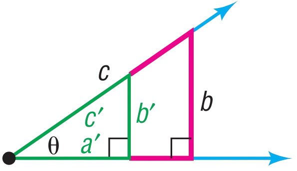
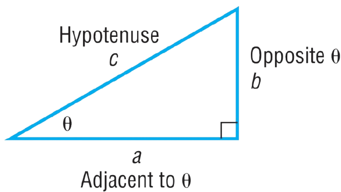
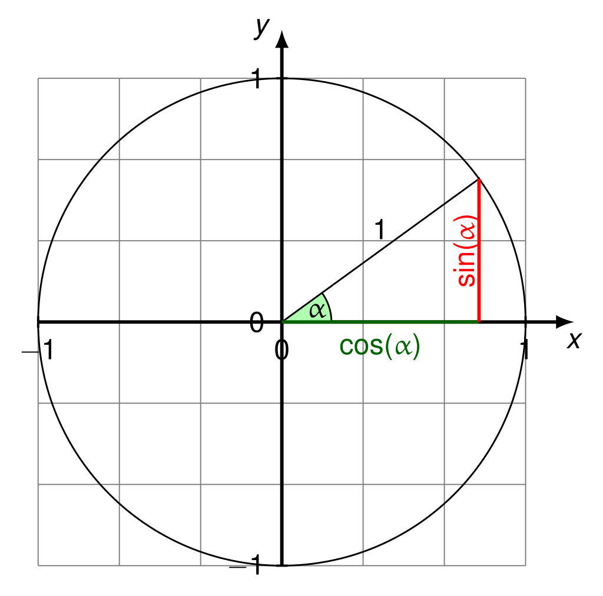
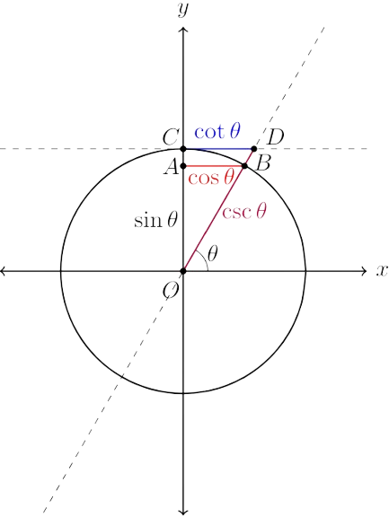
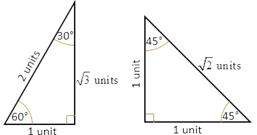

Based on [Paul's Online Math Notes](https://tutorial.math.lamar.edu/) by [Paul Dawkins](https://www.linkedin.com/in/paul-dawkins-b7282b12) at Lamar University

where you can find practice and notes on Math Topics typically taught Pre-University

> However it doesn’t contain full topics for geometry and trigonometry sadly so gotta find those resources somewhere else check out [[#Resources]].
>
> Therefore these notes are more Algebra and Calculus Leaning, not so much Geometry. Unfortunately, I did not have time to go through Calculus, but maybe I’ll come back to update this. Or I’ll have a separate resource for this.

---

# 🏃‍➡️ BEFORE YOU START

**Notes are always secondary to practice and self-learning. It is not truly useful unless you do the work yourself.**

**Knowledge doesn't stick unless you practice using them correctly.**

- *They can be great support material but fuel is nothing without an engine, and the engine is nothing without the operator.*

**Do the work, and the support will work its magic.**

---

# ❓ HOW TO USE THIS RESOURCE

This resource is meant to be used alongside [**Paul's Online Math Notes**](https://tutorial.math.lamar.edu/) tutorials, but you can use it without that as well because this note contains a lot of general points that will apply to your math questions with or without the original reference.

This is **not a perfect resource**, I try my best but it will happen that you have a doubt I did not cover.

Thus, couple this with both **Paul’s Online Math Notes**, **YouTube**, or any other resource you can find online. 

Learning happens best through diversity, by **seeing the same problem through different lenses** you gain a more comprehensive understanding of the topic.

Just jump between different sections, **read in whatever order you want**, you aren’t limited to reading it linearly like section by section. Bravely **skip sections** if you don’t want to read it, just know you can always find it on the *Document Tab*

- Jumping straight to the Math Topics is my recommendation:
  [[#🔡 ALGEBRA | Algebra]]

You don’t have to completely understand things that you just read, it would be great if we did but usually it will take a while and with some application to understand it

The sections are only to group resources together in a reasonable way so it is easier to find it, leverage **Ctrl + F** *(Windows)* or **Cmd + F** *(Macbook)* to quickly find specific words or words related to concepts you are thinking about

Use the Document tab on the left-hand side to navigate between different sections

[[#🌐 GENERAL NOTES | GENERAL NOTES]] contains some general thoughts of mine on learning maths

[[#❗ LIST OF ERRORS | LIST OF ERRORS]] contains some errors I caught myself doing, which you can take reference to correct your own error habits

[[#🗒️ TECHNICAL NOTES | TECHNICAL NOTES]] contains a lot of specific math gotchas and information that you should know. Answering my own questions—and hopefully yours—on why we can and cannot do some things in math that is often glossed over or not explained well in school

[[#🔡 ALGEBRA | ALGEBRA]] contains notes I wanted to clarify or summarise on each algebra section of Paul’s Online Math Notes

[[#📐TRIGONOMETRY | TRIGONOMETRY]] contains trigonometry essentials that I gathered from [Sullivan’s Algebra and Trigonometry](https://home.ufam.edu.br/andersonlfc/Nivelamento_Matem%C3%A1tica/Algebra%20&%20Trigonometry%20-%20Sullivan/Sullivan%20Algebra%20&%20Trigonometry%209th%20txtbk.pdf)
  
[[#📊 CALCULUS I | CALCULUS I]] doesn’t yet contain anything as while proving the rules, I learnt so much that I wrote it in jupyter notebooks instead. Straying away from this note. If I ever come back I will consider adding it here

*————— With that said, let’s dive into the meat of it all*

---

# 🌐 GENERAL NOTES

**Seek to understand the whys of everything, not just the hows, it will be more convincing to you and more obvious why you would do this step in this way when you know the reasons behind it.**

- You can get help from Youtube, AI Assistants, friends, family, teachers and peers to this end. Tedious as it may, it will not stick unless you have done enough of the work and understood the whys of it all

\- Don’t be afraid of weird and novel names for things, go beyond the veil of this scary new thing to focus on understanding what that it is describing. If you can’t, reframe the name of the new term with something already familiar in your mind, like hypotenuse \= slanted line which is longest line, use the easy reference for your own reference, and connect it as hypotenuse for other people’s reference

\- Don’t be afraid to **write down all the expressions when doing math**, clarity is of utmost importance in logical subjects much like what mathematics is literally all about

\- Showing work is important for marking. Some work may be skipped but some are not so obvious to the teacher how you got it so incorporate that into your workings too

\- Repeated Errors mean you don’t understand it enough or there is systematic skipping of some crucial step that keeps skipping memory.

\- Read the problem twice, first to get the idea of what is happening and what to find, second to get clearer idea and note down the information given

\- Move on from problems if you are stuck at it, or you may end up spending too much time on it and not enough on problems you can do. However, do write down whatever work you have for those that you can't, extra marks.

\- Rework problems from each topic until you can do them with ease

\- Always helpful to draw out the question so as to visualise better

\- As always, making the question into the familiar form is very helpful, don’t be arrogant and then make mistakes later, we are all human, we see this and we think oh I can do it I got this intuitively, and then some simple mistake is made because it slipped your mortal non-machine minds

---

# ❗ LIST OF ERRORS

\- Glossing over working too rapidly thus making calculation mistakes

\- Expand everything, do not skip steps

\- Be sure to look through all possible restrictions.

i.e. radicands on both the numerator and denominator,
denominator radicands can't be equal to zero

\- Look out when different units are involved, they can only be calculated together if they are the same units

\- Forgetting to carry some units like

---

# 🗒️ TECHNICAL NOTES

\- When deriving something, aim for to manipulate algebraic terms with a goal in mind, you might find a pattern that applies equally to all of the terms

\- Write out things clearly, the accuracy of your calculations depends heavily on knowing what you are calculating

\- Keep up with basic arithmetic, don't pride yourself with your intuition too much, use the barebones method for consistency

\- When equating expressions, prefer to work with whole number coefficients instead of fractions as **they make easier calculations earlier**

> When comparing 2 expressions like 
> 
> $$a_n - 2a_{n-1} = 3^n \quad \text{and} \quad a_{n-1} - 2a_{n-2} = 3^{n-1}$$
> 
> Prefer to convert the $2^{nd}$ expression to 
> 
> $$3a_{n-1} - 6a_{n-2} = 3^n$$ 
> 
> For equating with the first instead of the other way around where we convert the $1^{st}$ expression to $$\dfrac{1}{3} a_n - \dfrac{2}{3}a_{n-1} = 3^{n-1}$$
> 
> For equating with the second 

\- The **number of numbers** between some *starting number* and some *ending number* is 
> ***1*** + ***difference*** 
> (accounting for the start number) + (the number of numbers after the *starting number* up to the *ending number*)

\- When subtracting a bigger number from a smaller number i.e. $13 - 17$, it may be easier to think of it as $- (17 - 13)$, as the subtraction is now done with the larger term in front and we just have to add a negative sign afterwards. 
> This is a property of [[#Negative of a Difference | Negative of a Difference]]

\- Leverage the [[#Zero-Product Property | Zero-Product Property]] to find solutions and factors

\- When balancing an equation like a + 2 = 3, instead of doing a = 3 - 2 like how you might’ve been taught. It may be easier to think of it as ***what*** + 2 = 3. *Complements to addition* may be easier to think of than direct subtraction

\- **Factor instead of divide when you can**, division requires excluding [[#Division by Zero | division by 0]] for it to be a function, so if you use divide you have to remember this extra condition. 
> Factoring has no such weakness and always works.

\- When required to give answers with radicals, rationalise them in final form, but keep them in radical form if they are also required for intermediate calculations

\- Mouth the expansion with $(a+b)^2$, catches small mistakes

\- Shapes are relative in nature, what is its height at one point of view when turned sideways becomes the base. You have to shift the view point so that it is relative to whatever is important, for example, finding the opposite side of a right angle triangle, you have to take note of the angle then find the opposite side to that angle, you have to view the problem relative to the triangle’s orientation, but when it is in your face, the problem is simplified because your viewpoint and the triangles orientation has synced.

\- Whenever requiring to do operations on in both directions, get the required fraction through the first operation and then won't need to recalculate it the second time

\- If the signs of a bracket is positive, then the brackets are ignorable

\- Remember that subtraction is literally for finding the difference. It is easier to find the absolute difference and then add the direction to the difference.

---

#### Properties of Equality

| **Property**              | **Rule**                                       | **Explanation**                                      |
|--------------------------|-------------------------------------------------|------------------------------------------------------|
| Reflexive                | $a = a$                                          | Anything is equal to itself                           |
| Symmetric                | If $a = b$, then $b = a$                          | Order doesn't matter                                   |
| Transitive               | If $a = b$ and $b = c$, then $a = c$               | Equality passes through                                |
| Addition                 | If $a = b$, then $a + c = b + c$                   | Adding same value preserves equality                   |
| Subtraction              | If $a = b$, then $a - c = b - c$                   | Subtracting same value preserves equality              |
| Multiplication           | If $a = b$, then $a \cdot c = b \cdot c$            | Multiplying same value preserves equality              |
| Division                 | If $a = b$ and $c \ne 0$, then $\dfrac{a}{c} = \dfrac{b}{c}$         | Dividing by same nonzero value preserves equality      |
| Substitution Property    | If $a = b$,  then they substitute each other | Interchangeable in any expression            |

#### Equivalence Relation

$\large{\text{If} \space f(a)=f(b), \space \text{then} \space a=b}$

Write down restrictions for equations and check whether solutions are correct in this situations

Whenever we multiply the entire equation by a variable, or we do some operation on both sides of an equation, we are bound to introduce some extra solutions.

When encountering a radical, a fraction, an absolute value, trigonometric functions, write down the restrictions and combine them into 1 single restriction so you can check your answers against it.

#### Negative of a Difference

$$
\large{
	a - b, \space \text{where} \space b > a
}
$$

Since ***b > a***, it will be easier to do the subtraction if we put ***b*** in front of ***a***, lets see what happens

$$
\large{
	b - a, \space \text{where} \space b > a
}
$$

Notice that this is not the same expression anymore, as ***a*** has become ***-a***, and ***-b*** has become ***b***

Notice again that by flipping the position of ***a*** with ***b***, those 2 terms have also individually *become its negative counterpart*

$$
\large{
	-(-b) + (-a), \space \text{where} \space b > a
}
$$

Thus, to keep the current position of ***b*** in front of ***a***, but without changing the polarity of each term, we must **apply** again a **negative sign on both terms** to **correct it back**

$$
\large{
	-[-(-b)]+[-(-a)], \space \text{where} \space b > a
}
$$

Which we can simply see that it is applied to both together, so we can just **group the terms together** and then **apply negative on the group instead** 
(This is what is known as the ***distributive law***)

$$
\large{
	-[-(-b)+(-a)], \space \text{where} \space b > a
}
$$

Then we simplify this back to the ***b - a*** form that we liked to use

$$
\large{
	-(b-a), \space \text{where} \space b > a
}
$$

This is now equivalent to ***a - b***, where ***b > a***

#### Fractional Representation of  Multiplication and Division

> Multiplication can be thought of as **amounts of the same something**
> Division can be thought of as the **subparts of the same something**

We usually represent them together into a fraction
> Grouping size for division (**denominator**)
> Amounts of a single group unit for multiplication (**numerator**)

$$
\dfrac{\text{Amount of Grouping Unit}}{\text{Grouping Size}}
$$

**The division sign $(\div)$ and multiplication sign ($\times$) are almost never used for operations on single numbers as *fractional representations* have proven to be more convenient**

#### Zero-Product Property

$\large{\text{If} \space ab = 0, \text{then} \space a=0 \space \text{or} \space b=0}$

This is commonly used for quadratic equations, but it is a generally very helpful property of zero-products to know and use

#### Division by Zero

Multiplication by $0$ will give zero, but division by $0$ doesn’t have one defined answer (the answer can be anything. I.e. it can be 1 ,2, 3, …), this inconsistency causes division by zero to remain undefined in its formal definition.

#### Solving Equations with Fractions

Always assume denominators are non-zero to avoid division by zero, it is defined within the mathematical definition of division to avoid inconsistencies.

#### Inverses and Reciprocals

An **Inverse** is a general concept where things are **direct opposites of each other**.

***Addition* and *Subtraction*** are **inverse operations**

***Multiplication* and *Division*** are **inverse operations** [[#Division by Zero | OTHER THAN DIVISION BY 0]]

Exponential Function, Power Functions to Radicals, Logarithms are imperfect inverses if we take the whole domain and range of those functions, because they don’t match. However, within limited domain and range they can be perfect inverses

##### Reciprocals
Reciprocal is a name for the inverse of [[#Fractional Representation of  Multiplication and Division | fractional representation of multiplication and division]]

Since multiplication and division are [[#Division by Zero | almost always]] **opposites** of each other, the **inverse of such a representation** is to **swap the numbers that represent multiplication and division**

Thus **swapping the numerator and denominators**
- If **x** is the multiple, then the multiplicative inverse, is $\dfrac{1}{x}$
- $\dfrac{1}{x}$ is the reciprocal of **x** 
- While **x** is also the reciprocal of $\dfrac{1}{x}$
- And $\dfrac{a}{b}$ has the reciprocal of $\dfrac{b}{a}$

##### Effects of Applying Opposite operators
When inverse operators are **applied twice**, the effect is that it applied the operator and then applied the operator with the **direct opposite effect of the first operator**

Thus resulting in **no net change**

> E.g. -(-3) = 3 <--- Also known as ***Double Negative***
> E.g. a + b - b = a
> E.g. 1/(1/x) = x 

#### Cross Multiplication — Numerator Comparison Simplification

While solving an algebraic equation, very often we might get 2 fractions equalling each other.

$\dfrac{2x}{x+1} = \dfrac{2x-1}{x}$ where $x \ne 1$, $x \ne 0$

- If you don’t understand why we need to have these conditions every time we solve an equation with fractions, look [[#Solving Equations with Fractions | here]]

To equalise the fractions for easier comparison, while keeping the expressions the same value, we can do this:

$$
\frac{2x}{x+1} \left( \frac{x}{x} \right) = \frac{2x - 1}{x} \left( \frac{x+1}{x+1} \right)
$$
$$
\frac{2x^2}{x(x+1)} = \frac{(2x - 1)(x + 1)}{x(x + 1)}
$$

Now we can compare just the numerators because in an equation where either the **denominators**/**numerators** are equal, and the expressions on both sides are equal, then the **numerators**/**denominators** must also be equal

$$
2x^2 = (2x - 1)(x + 1)
$$

So as it seems this is equivalent to just *taking the denominator of each side* and *having the other side multiply by it*, while *removing the denominators on both sides*

- This trick is known as **cross-multiplication**.

$$
\dfrac{2x}{x + 1} = \dfrac{2x - 1}{x}
$$

**…after cross-multiplication**

$$
(2x)(x) = (2x - 1)(x + 1)
$$

$$
2x^2 = (2x - 1)(x + 1)
$$

After solving, check that your solution doesn’t violate the [[#Division by Zero | axiom of division]]

For example, let’s continue solving:

$$
\begin{align}
2x^2 &= 2x^2 + 2x - x - 1 \\
0 &= 2x - x - 1 \\
0 &= x - 1 \\
x &= 1
\end{align}
$$

Luckily, $x = 1$ does not violate  $x \ne 1$, $x \ne 0$. Therefore, it is a solution!

**Conclusion**
Now you know why the cross-multiplication trick works, it is because of pattern spotting done on that original process, and optimising it and it happened to be very intuitive.

Therefore, cross-multiplication works because of the reasoning behind it, not just by chance.

Just always remember this is a trick, not the most direct property of algebraic manipulation

#### Common Range Restrictions

**Domain Restrictions**
> Denominator  $\ne 0$, (see [[#Division by Zero]])
> **Even** Radicands  $\ge$ 0, If even radicand in denominator, Radicant > 0

The reason is that odd radicands can be negative because the radicands base can be negative, thus giving negative answers at odd powers. This is untrue for even powers because whatever real value the base is the result will always be positive. Check [[#Restrictions of Even Powers | Restriction of Even Powers]]

**Proof that cube root of negative numbers are negative cube roots of their absolute value**

$\sqrt[3]{-x}$, where x is positive $\longrightarrow \sqrt[3]{-1} \cdot \sqrt[3]{x} \longrightarrow (-1) \cdot \sqrt[3](x) \longrightarrow -\sqrt[3]{x}$

**Therefore,**

$\boxed{ \phantom{\biggr(} \sqrt[3]{-x} = -\sqrt[3]{x} \phantom{\biggr)}}$

###### Restrictions of Even Powers

$x^2 \ge 0$, and by extension any even power

###### Definition of Absolute Value

$|x| \ge 0$, by definition

###### Restriction of Logarithms

$b^x > 0$, thus $b^x = p > 0$ in $\log_b{p}$

However, $\log_b{p} \in \mathbb{R}$  , since any power is possible

#### Restrictions of Trigonometric Functions

$-1 \le \sin{x} \le 1 \space ————— \space \sec{x} \le -1 , \sec{x} \ge 1$
$-1 \le \cos{x} \le 1 \space ————— \space \csc{x} \le -1 , \csc{x} \ge 1$

#### Parameters and Variables

In something like $y = mx + c$

- $m$, $c$ are parameters
- $x$, $y$ are the variables

Even though in the general sense they are all variables, $x$, $y$ are variables the whole way through but $m$, $c$ become constants once they are defined.

#### Properties of Identities

An identity is an equation that remains true for all permissible values of the variable.

This will come to be very helpful when you need to find the value of undefined constant, and you can substitute convenient values of $x$ to remove big bracketed factors to just $1$ or $0$ depending on your needs

#### Triangle Inequality

$$
\large{a + b \ge c}
$$
> where $c$ is the longest side, $a$ and $b$ are the other 2 sides of ANY Triangle

#### Pythagorean Theorem

$$
\large{a^2 + b^2 = c^2}
$$
> where $c$ is the longest side, $a$ and $b$ are the other 2 sides of a Right-Angled Triangle

**Here is a list of pythagorean triples that’s good to keep in mind**

- $(3, 4, 5)$
- $(5, 12, 13)$
- $(8, 15, 17)$
- $(7, 24, 25)$
- $(9, 40, 41)$
- $(11, 60, 61)$
- $(12, 35, 37)$
- $(13, 84, 85)$
- $(16, 63, 65)$
- $(20, 21, 29)$

#### Isosceles Triangle Properties

NOTE: Equilateral Triangles are also isosceles triangles, they are just isosceles 2 ways

In an isosceles triangle, the angle bisector of the vertex angle is the perpendicular bisector of the base.

#### Quadratic Equations

Quadratic Equations comes in this form

$$
ax^2 + bx + c
$$

We know that through completing the square, the Quadratic Equation comes to

$$
\dfrac{-b \pm \sqrt{b^2 - 4ac}}{2a}
$$

But when ***a*** is *1*, ***x2*** just comes as its own without any appended number

$$
x^2 + bx + c
$$

We can skip evaluating ***a*** and use it like this

$$
\boxed{
 \phantom{\Biggr(}
 \dfrac{-b \pm \sqrt{b^2 - 4c}}{2}
 \phantom{\Biggr)}
}
$$

When ***b*** is *1*, ***x*** just comes as its own without any appended number

$$
ax^2 + x + c
$$

We can skip evaluating ***b*** and use it like this

$$
\boxed{
 \phantom{\Biggr(}
 \dfrac{-1 \pm \sqrt{1 - 4ac}}{2a}
 \phantom{\Biggr)}
}
$$

But when ***c*** is *1*,

$$
ax^2 + bx + 1
$$

We can skip evaluating ***c*** and use it like this

$$
\boxed{
 \phantom{\Biggr(}
 \dfrac{-b \pm \sqrt{b^2 - 4a}}{2a}
 \phantom{\Biggr)}
}
$$

And when taken to the extreme where all the coefficients are *1*, we will get this

$$
\dfrac{-1 \pm \sqrt{1 - 4}}{2}
$$

Which simplifies to this, which becomes an imaginary number because it can be [**separated into 2 terms that have opposite polarity**](#bookmark=id.sb1zo2ka466m)

$$
\boxed{
 \phantom{\Biggr(}
 \dfrac{-1 \pm \sqrt{3}i}{2}
 \phantom{\Biggr)}
}
$$

#### Completing the Square

$$
\begin{align}
 x^2 \pm ax
 &= x^2 + 2x\left(\frac{a}{2}\right) + \left(\frac{a}{2}\right)^2 - \left(\frac{a}{2}\right)^2 \\
 &= \left(x \pm \frac{a}{2}\right)^2 - \left(\frac{a}{2}\right)^2
\end{align}
$$

Hence  $x^2 \pm ax = \left(x \pm \frac{a}{2}\right)^2 - \left(\frac{a}{2}\right)^2$ , do the entire expansion if you aren’t COMPLETELY confident why the left equals the right side

When collapsing completing the square, read the first term and the sign after it, and then read the last term's base. That would be efficient and mistake-proof.

#### Opposite-sign Solution Pairs

When we get something like $x = \pm 2$, then $y = -x$ , we actually get $y = \mp 2$

Negative sign flips the sign, and for we have to remember to flip the signs in **Opposite Sign Pair Notation** to preserve this opposite relationship between $x$ and $y$ whenever they are opposites of each other

It can also be beneficial to use opposite-sign pairs during calculation to do conjugate calculations together, just remember to flip the signs when necessary

List the solutions using opposite-sign pair notation is not as clear when it is both $\pm$

It is therefore recommended to just expand out all the solutions when doing so

#### Number of Common Zeros of n Polynomials / Bézout's Theorem

The **maximum** number of common zeros equals the product of the degrees of the polynomials

- It isn’t exactly that number because of repeated zeros

$$
xy = 4  \quad (\text{Degree} \space 2)
$$
$$
\dfrac{x^2}{4} + \dfrac{y^2}{25} = 1 \quad (\text{Degree} \space 2)
$$

Maximum Number of Common Zeroes
$\begin{align}&= 2 \cdot 2 \\ &= 4\end{align}$

**Refresher**

- The degree of a polynomial is the largest degree among all the terms
- The degree of a term is found by summing the exponents of all **unique variables** present in that term

#### Parametric Form

It is a simplification of parameters by restating every equation in terms of one other parameter allowing one parameter to be substituted into all the relevant equations

---

# 🔡 ALGEBRA

---

## PRELIMINARIES

---

### --- Integer Exponents / Power Functions

$$
\Huge x^p
$$
> This depicts variable base to constant power

| Expression      | Value         | Valid When         | Notes                                                                 |
|----------------|---------------|--------------------|-----------------------------------------------------------------------|
| $x^0$          | $1$           | $x \ne 0$          | Defined to preserve exponent laws: $x^a \cdot x^b = x^{a+b}$          |
| $1^x$          | $1$           | All $x$            | Always 1, even for irrational or complex $x$                          |
| $0^x$          | $0$           | $x > 0$            | Makes sense as repeated multiplication of 0                           |
| $x^1$          | $x$           | All $x$            | Identity exponent                                                     |
| $x^{-1}$       | $\frac{1}{x}$ | $x \ne 0$          | Reciprocal                                                            |
| $0^0$          | Undefined or $1$ | Context-dependent | Indeterminate in calculus; often defined as 1 in combinatorics        |
| $x^{1/n}$      | $\sqrt[n]{x}$ | Depends on $x, n$  | Even roots require $x \ge 0$ in reals                                 |
| $(-1)^n$       | $\pm 1$       | Integer $n$        | Alternates sign: 1 if even, –1 if odd                                 |

This is one way to depict repeated multiplication, we will explore constant base to variable power in [[#Exponential Functions | Exponential Functions]]

**Steps**

- Ignore power-0
- Expand the brackets
- Push negative powered terms to its opposite fraction side
- Simplify the terms at the numerator and denominator
- Simplify the terms between numerator and denominator

$$
(2a^3b)^{-2} \left(\frac{3a^{-1}b}{18a^5b}\right) = \frac{4a^{-4} \cdot 3a^{-1}b}{18a^5b} = \frac{4a^6 \cdot 3b^3}{18a^5b^a} = \frac{2b^3}{3}
$$

---

### --- Rational Exponents

Rational Exponents are exponents that can be written as a **Fraction**

- Since any thing that can be written as an exact proportion can be much easily reasoned about
- Fractional powers indicate which power it's supposed to get. $216^{\frac{2}{3}}$ means the 2nd power of cube root of 216, but because I know the cube root is 6 I can easily get the 2nd power
- Odd exponents always keep the sign (no matter exponentiated or rooted),
- Even rooting is positive by convention when a is positive. This is for simplicity. When the negative root is required it has to be explicitly stated.

---

### --- Radicals/Roots

Radical functions find the **positive base** of any **real number** i.e. **Roots**

- It wouldn’t be a function (i.e simple and predictable relationship with one-to-one correspondence ) if allowed finding
negative bases

- Prime factorising numbers is a good way to check if the term is totally simplified under radicals
- Rationalisation with constants: Get the next biggest number
- Substitution always helps

---

### --- Polynomials

Polynomials are simply algebraic expressions made up of terms that are raised to **positive integer powers**.

This standardisation makes algebraic expressions much easier to work with

Thus expressions like these are polynomials

$$
6x^4 + 8y^4 - xy^2
$$

While expressions like these aren’t:

$$
4\sqrt{x} - \dfrac{1}{x}
$$

Distributive property is used extensively

- Perfect Square Trinomials

$$
(a \pm b)^2 = a^2 \pm 2ab + b^2
$$

- Difference of Squares

$$
(a^2 - b^2) = (a + b)(a - b)
$$

- Difference of Cubes

$$
(a^3 \pm b^3) = (a \pm b)(a^2 \mp ab + b^2)
$$

The degree of a polynomial is the highest degree term, which is the sum of the degrees of each variable in that term

Be meticulous

---

### --- Factoring Polynomials

$$
\large{y = x^2 + \dfrac{b}{a}x + \dfrac{c}{a}}
$$

> Where $x_1$ and $x_2$ are roots
> $\dfrac{b}{a} = x_1 + x_2$
>
> $\dfrac{c}{a} = x_1x_2$

##### Remainder Theorem

$$
\large{P(x) = (x - r) \cdot Q(x) + R}
$$

> $P$ is the polynomial
> $(x-r)$ is a factor
> $r$ is the root/zero
> $Q$ is Quotient
> $R$ is Remainder

**Hence if the divisor is $(x-r)$, the remainder R  is equal to $P(r)$**

##### Factor Theorem

Continuation of the [[#Remainder Theorem | Remainder Theorem]]

Where if $P(r) = 0$ it means the remainder is $0$, meaning $(x-r)$ is a factor of $P(x)$ if $P(r) = 0$

**This fact is convenient for us to test for whether a number is the root of a polynomial**

**Steps to take**

- Look for GCF first, greatly simplifies any factoring
- Turn negative powers to positive powers, keeping the overall expression the same
- Try substitution
- See if it can be grouped by their root properties
- Look for common quadratic and cubic expansions
- Look for common ratios between coefficients of terms to group
- Try using the quadratic equation
- Try [[#Completing the Square | Completing the Square]], its otherwise easier to just sub in for quadratic equation
- If all else fails then guess and check might be in order,
- Or use the Rational Root Theorem which states that a factor of the last term over that of the first term may be a factor.
- Combining this with Factor Theorem which states that if $f(a) = 0$, then $(x - a)$ is a factor of $f(x)$
- Also try common factors like $0$ and $1$

---

### --- Rational Expressions

- Factor out GCFs as usual, makes it a whole lot easier
- For quadratic expressions containing reversed terms like $(4 - x)$, it may be easier to just change it to the familiar $-(x - 4)$.
- Otherwise solve it like this $(\boxed{\phantom{x}} - x)(x + \boxed{\phantom{x}})$
- For fractions where the numerator and denominator are way too long, just factor it out by the side. i.e. $\biggr( \dfrac{1}{2x^2 + 6x + 1} \biggr)$
- Cancel out individual terms with care

---

### --- Complex Numbers

$$
\Huge{z_1 = a + bi}
$$
> Whereby a denotes a real number and b denotes the coefficient of the imaginary number bi

- Positive square root is taken by convention
- Cycle of $i^n$ repeats every  $n = 4$

 $$
 i \Longrightarrow -1 \Longrightarrow -i \Longrightarrow 1
$$

- The law of distribution works for radicals but doesn’t mean it should for imaginary numbers.

##### Rules of Complex Numbers

Imaginary numbers don’t do this like radicals do because

$$
\sqrt{ab} \ne \sqrt{(-a)(-b)}
$$

As

$$
\sqrt{(-a)(-b)} = \sqrt{-a} \cdot \sqrt{-b} = \sqrt{a}i \cdot \sqrt{b} i = -\sqrt{ab}
$$

Which

$$
\sqrt{ab} \ne -\sqrt{ab}
$$

But within imaginary number’s definition we CAN do this

$$
-\sqrt{ab} = \sqrt{(-a)(b)} = \sqrt{(a)(-b)}
$$

A conjugate is switching the operator between 2 terms. But it does not switch up the numbers themselves. For example, the conjugate of $(-9 + 5x)$ is $(-9 - 5x)$ and NOT $(9 - 5x)$

The conjugate is defined by convention to keep the rational part intact and flip the sign of the radical/imaginary part so it is easier for us to reason about it..

##### Complex Numbers Expansion Counterparts

$$
(a \pm bi)^2 = a^2 - b^2 \pm 2abi
$$
$$
(a + bi)(a - bi) = a^2 + b^2
$$

You will notice that only the part with b2 will have its sign flipped from positive to negative when it is in a complex expression

##### Modulus of Complex Numbers

This is more like a definition in this scenario whereby imagine a plane where the ***x***-axis is the Real Number axis and the ***y***-axis is the Imaginary Number axis. The space that is described by these axes is called the **Complex Plane**

The modulus therefore describes the **distance from the origin to that specific point that the complex number is at**.

Draw it out and you will find out that the real number axis, imaginary number axis and the distance to the point creates a right-angled triangle *(because of how the axis are defined as perpendicular to each other i.e. $90^{^{\circ}}$ apart)*.

Therefore, the modulus will follow the [[#Pythagorean Theorem | Pythagorean Theorem]]

$$
|z| = \sqrt{a^2 + b^2}
$$

Of course you will find that trivially the modulus of complex expressions without **a** or **b** will just be **a** or **b** itself

**Properties of Complex Numbers**
Due to the [**Triangle Inequality**](#triangle-inequality),

$$
|z_1+z_2| \le |z_1| + |z_2|
$$

and consequently,

$$
|z_1 - z_2| \ge |z_1| - |z_2|
$$

---

## SOLVING EQUATIONS AND INEQUALITIES

---

### --- Solution and Solution Sets

Solution sets $\emptyset$, $\{z | z \ge -5\}$, $\{-3,3,5\}$

Look out for immediate invalidations like division by $0$

---

### --- Linear equations

Requiring a good level of mind maths in factoring tbh, like:

$$
t^2 + 5t + 4 \Longrightarrow (t + 4)(t + 1 ) \Longrightarrow t \ne -4, t \Longrightarrow -1
$$

Trick here is to make the denominator the same so that you can just solve the numerator no biggie, which does use cross multiplying

---

### --- Applications of Linear Equations

Set up the equation on the relationships described in the question and revolve around the answer

- Find the constant and revolve around it
- A lot of rate equations that go **rate** $\cdot$ **time** + **rate** $\cdot$ **time** = **total**
- The **total** would be specified so when you define one of them as $x$ the other will be **(total - $x$)**

Add an extra $0$ for decimals makes it easier to not mess up calculations

Continue in decimals if it’s easier

---

### --- Equations With More Than One Variable

Seek to isolate the variable in question

Then, remove everything around it from the sides and layer by layer

It’s good to have mind’s eye for grouping multiples by isolating each term

Prefer to group terms together such that the leading term is positive, it's easier to work with down the road, less mistake-prone as well

Consider using pencil to do simplification division so that it's easier to show working without it being permanent. Also easier to spot mistakes in term transfer.

Lookout for switching signs when moving terms from one side of an equation to another

Combine into one single fraction with a factored numerator and denominator.

---

### --- Quadratic Equations

- The fundamentals for this content is [[#Factoring Polynomials]]
- AGAIN, it is useful to always find the restrictions / invalid solutions of a polynomial before solving for it, i.e. when fractions/radicals are involved
- Simplify the equations to a familiar form before applying the formula
- Present the solutions separately
- If there are no constants in the quadratic equation it definitely has real solutions

---

### --- Applications of Quadratic Equations

- Just read the question properly and lock in
- Also preserve the real answer for calculating other figures and not use the approximated value for internal calculations
- If numbers get too big just put them in uncalculated form

---

### --- Equations Reducible to Quadratic in Form

- Don’t be careless, look out for negative powers so you know the restrictions that the answers can be
- Keeping the negative sign beside constants and numerators. This keeps fractions rationalised.

$$
x^2 = -\dfrac{1}{2}
$$

Let it be

$$
\dfrac{-1}{2}
$$

Instead of

$$
\dfrac{1}{-2}
$$

When it is rooted the radicals/imaginary numbers are already at the numerator

- Use quadratic formula for simple quadratics that cant be factored
- Looking at the terms inside brackets can enable fast-skip-steps
- Odd roots retain the sign, even if its negative
- Use substitution
- Also check if the $x$-form is $x$ or not, you might have forgotten to reduce the substituted $x$-form to just $x$

---

### --- Equations with Radicals

- Analyse the radicals to find restrictions at the start

Note that this only applies for even radical like square root, fourth root etc, odd radicals doesn’t have this restriction

$$
\sqrt{A + 2} \quad \text{then} \quad A + 2 \ge 0 \quad so \quad A \ge -2
$$

- Shifting terms to isolate the radical on one side is the way to go
- If there are more than 1 square root, isolate them one on each side
- Use the hybrid method of addressing limitations from analysis of the radicals and the equation to weed out answers that are definitely wrong, and then double check the answer that isn't weeded out.
- Otherwise use substitution for checking answers, simplicity over speed.
- Watch out for your inequalities, might have the numerator and denominator mixed up when forming them

---

### --- Solving Equations and Inequalities

- When flipping the inequality signs with double inequalities, remember to also multiply constants with negative signs.
- Write down the solved calculations first when doing double inequalities, brings the workload off the brain therefore reduces mistakes
- These are double inequalities: $-3 \le x \le 9$

---

### --- Polynomial Inequalities

- Arrange by the largest term in front
- When negative terms are involved simply simplify by multiplying by negative and switching the signs
- Ensure that the constant on the side is 0. It doesn't work with other numbers because they don't have the zero-product property like zero does.

$$
\large{y = ax^2 + bx + c}
$$

- Find the roots
- If there is only 1 distinct root (i.e. 2 equal roots), then you can just solve the question trivially

$(x+3)^2 \le 0$ is False except at $x = -3$, which is its root

- Find the curve direction by looking at sign of $a$ in $ax^2$. Positive opens upwards, Negative opens downwards.

##### Finding sign of intervals of higher power polynomials

- Substitution is foolproof but there faster but more complex ways
- Ignore even-power factors because they will always be positive, focus on the rest odd-power factors

To tell how the polarity changes across roots, we can use:

###### Parity Power Check
>
> - Polarity changes for roots of factors that are odd-powered, while they stay the same for those that are even-powered.
>
> To tell what polarity of y the function starts from (from the left in this case, from negative x):
>

###### Leading Term Analysis With Limit Testing
>
> *- Divide the highest powered term in the numerator to that of the denominator.*
>
> A fast way to divide is to use parity characteristics
>
> Let x tend to $-\infty$ and check if the whole expression starts from *-ve* or *+ve* side of $y$
>
> - Assuming coefficients are the same,
> - Even power always positive
> - Odd power always negative
>
> If same power and coefficient then it always starts positive
>
> This works because at large numbers the leading term matters the most, the rest become more and more negligible the less terms it has, especially the constant

##### Interval Notation

- For Interval-Notation, write the intervals, then write the brackets
- Interval-Notation that excludes a number can be considered convenient but also informal.

 i.e. $\mathbb{R} \space \textbackslash \space x \ne 1$

Formally, it is explicitly separate as Two-part Notation (with Union sign).

$$
(-\infty, 1) \cup (1, \infty)
$$

Watch out for equal sign, might forget that they contribute to the answer
i.e. if $(y \cdots) \le 0$, and $y = 1$ is where it equals zero, $y = 1$ is an answer

---

### --- Rational Inequalities

- [[#Leading Term Analysis With Limit Testing | Leading Term Analysis With Limit Testing]]
- Whenever finding solutions are involved remember to keep its original form when you multiply or divide by $x$
- You can shift the denominator to the side if it proves to be easier to do numerator calculations this way

---

### --- Absolute value equations

- As long as one side has an absolute value sign, it will be split into exactly 2 equations. One positive, one negative.
- Even for equations where absolute value exists on both sides ultimately reduces into those 2 parity equations.
- Make sure of the restriction that an absolute value must be non-negative.

---

### --- Absolute value inequalities

If $|a| \ge 1$  then it is outside of $1$ from $0$ in both directions

$$
|x| \ge 1 \quad \text{then} \quad x \ge 1 \quad or \quad x \le -1
$$

If $|b| \le 1$, then it is within $1$ from $0$ in both directions

$$
|x| \le 1 \quad \text{then} -1 \le x \le 1
$$

---

## GRAPHING AND FUNCTIONS

---

### --- Graphing

$$
\huge{y = ax^2 + bx + c}
$$

- Slope is $a$
- ***y***-intercept is $c$
- Solve for when $y=0$ to find its roots
- Take note of the shape of graphs before sketching, or plot points to sketch them
- Use knowledge of graph transformations to draw graphs in general

---

### --- Lines

**Point-Slope Form**
$$
\huge{y = y_1 + m(x - x_1)}
$$

- Slope is the rise over the run, so just ratio of difference of $y$ to difference of $x$
- Point-slope form is faster than substitution
- The reason we used $y$ and $x$, is because it is a general equation for any specific point $(x,y)$ to any variable point $(x, y)$
- A parallel line would have the same slope
- A perpendicular line has slope of opposite direction and magnitude

---

### --- Circles

$$
\large{(x - h)^2 + (y - k)^2 = r^2}
$$
> Where $(h,k)$ is the **centre** of the circle, and $r$ is the **radius**

Break down the equation into its readable form, and write down the derived parameters before drawing out the circle, makes less mistakes with double negatives

- [[#Completing the Square | Completing the Square]] is useful for simplifying expressions into the familiar circle equation

##### Drawing the Circle

- Write down the centre coordinates from reading the equation so you don’t get confused writing it as negative $x$ or $y$ coordinate
- Mark the centre
- Then, find the coordinates perpendicular and parallel of the centre, mark the left right with the $x$ coordinates for $x$-axis and $y$-coordinates for $y$-axis. Fill in the rest of the coordinates
- Look out for magnitude if the radius and the $h$, $k$ coordinates are the same, the circle might intercept $(0,0)$

**Tips**

- Remember its $(x - h)$ and $(y - k)$, be careful around negatives again!
- Don't skip steps
- [[#Completing the Square | Completing the Square]]

---

### --- Functions

The point of functions is that we can reliably use it to determine d
**Function notation** $f(x)$

A function has 1 non-unique $y$-value per $x$-value. The other way around is fine as long as this is satisfied.

An easy way to determine if something is not a function

- Not a function if the power of $y$ is even
- Not a function if absolute values are involved

##### Finding Domain

Usually this is just R. However, note the [[#Common Range Restrictions | Common Domain Restrictions]], and remember that we are solving for the unit variable, sometimes due to how the expressions are used, even if some of the Common Domain Restrictions apply, there may be no restriction over the Real Values

##### Finding Range

If no restrictions in the domain there won’t be any in the range either, which means $\mathbb{R}$

However, there will be if there were restrictions

- Use your knowledge about the shape of the graph
- Substitute in values to find the minimum/maximum, or
- Turn it into a form where reading the minimum/maximum value is easy

##### Common things to take note of

Break the question down into its simpler forms

Inverse functions have to pass the horizontal-line test (to determine that it is still a function), therefore restricting domain is important to achieve this.

The range of each inverse function is its Principal Range, as in the range within $-\pi/2$ and $\pi/2$

- Principal domain and range are more of standardisations to allow ease of use for inverse functions

Remember that polynomial inequality is not the same as linear inequality.

Difference quotient isn't the whole calculus proof, the calculus proof is the LIMIT of the difference quotient. Therefore, cannot assume to differentiate when you are asked to take the difference quotient.

---

### --- Graph Sketching

Check out [**Desmos**](https://www.desmos.com/calculator) for this

#### Linear

$$
\large{y = mx + c}
$$

- Straight line
- $m$ is the gradient, positive go up, negative go down
- $c$ is the $y$-intercept
- $x$-intercept is therefore $\dfrac{-c}{m}$

#### Quadratic

$$
\large{y = ax^2 + bx + c}
$$

- U-Curve
- $a$ determines if the curve is gonna be very steep or gentle
- $\dfrac{c - b^2}{4a}$ determines its vertex, specifically the $x$ part of the vertex
  - If there is no $b$, the vertex stays at $(0,c)$
- $c$ determines where the curve intercepts the ***y***-axis
- Find its roots

#### Even Radicals

$$
\large{y = \sqrt[k]{x}}
$$
> Where $n$ is a multiple of $2$

- Half a U-curve
- Quadratic curve lain on its side and halved so only the positive ***y***-values exist. if its sqrt(-x) however, then it would lay on the negative ***x***-values side

#### Odd Radicals

$$
\large{y = nx}
$$
> Where $n$ is not a multiple of $2$

- S-curve
- Cubic curve laid on its side. No restrictions are present for odd roots

#### Reciprocal

$$
\large{y = \dfrac{1}{x}}
$$

- Curve that sticks close to the axis
- [POSITIVE] Very big y to very small y
- [NEGATIVE] Very big y to very small y

#### Absolute Values

$$
\large{y = |x|}
$$

Like a normal linear graph except that the parts that are in negative $y$-region will be flipped so they are in their corresponding positive $y$-regions

#### Piecewise

$$
f(x) =
\begin{cases}
x^2, & \text{if } x < 0 \\
2x + 1, & \text{if } 0 \leq x < 3 \\
5, & \text{if } x \geq 3
\end{cases}
$$

Check its low limit and high limit coordinates. Know its shape, according to what kind of graph is required to draw, find the required points, and then draw the whole thing out

---

### --- Combining Functions

- $G \circ F$  means  $G(F())$
- It is equivalent to $G \space \text{of} \space F$
- If any function lacks a variable, take $G = 2$ for example, then any function that $G$ is of, will just be $G$ itself.
- Let $F = 2x + 1$, $G \space \text{of} \space F = 2$, because it doesn't matter what $F$ is, there is no variable to substitute into $G$ Therefore, $G$ of anything is $2$

---

### --- Inverse Functions

- Simply inverse the functions. Functions inverse of each other cancel out each other's effects.
- Therefore $G^{-1}G = 1$, $G^{-1}G(w) = w$
- Just work from when x is isolated and work backwards.
- Let $f(x) = y$, easier to write as well
- Then at last, let $x = f^{-1}(x)$ and the problem is solved

- For problems with $\dfrac{ax+b}{cx+d}$, the expansion and regrouping tedious.
Hence, the shortcut inverse is this

$$
\text{Inverse of} \quad \dfrac{ax+b}{cx+d} = \dfrac{-dx+b}{cx-a}
$$

- We can see that $a$ and $d$ are swapped in position, and also negated.
- This is the shortcut, but go and derive this yourself so it sticks and you are convinced why this is correct, it also helps you catch mistakes in your work when using this shortcut because you know how it is derived.
- Finally look out for self-inverse functions, they are functions that negative each others effects thus causing no change to the input

- And because inverse functions swap $x$

---

## COMMON GRAPHS

---

### --- Parabolas

- Turns out the vertex from of $a(x-h)^2+k$ is so useful for finding both the vertex and its roots, but watch out for the negative at $-h$
- When drawing curves, use the vertex form, you can derive everything you need from it
- A faster way though is to check the sign of $a$, curve open upwards while a is positive, and curve open downwards while $a$ is negative
- Use graph transformations to have a general idea of where the curve is
- Everything else will fall in place. If the equation is simple you won’t need to do more than 2 steps

---

### --- Ellipses

$$
\dfrac{(x-h)^2}{a^2} + \dfrac{(y-k)^2}{b^2} = 1
$$
> $(h,k)$ is the centre,
> $a$ is the distance between the centre and the vertex of the $x$-axis
> $b$ is the distance between the centre and the vertex of the $y$-axis

- Sum of any point on the hyperbola to the 2 foci is constant
- Simply rearrange the equation to look like this and you are set
- Leverage [[#Completing the Square |Completing the Square ]] if required

---

### --- Hyperbolas

Horizontal hyperbola:
$$
\dfrac{(x-h)^2}{a^2} - \dfrac{(y-k)^2}{b^2} = 1
$$
> Opens left and right

Vertical hyperbola:
$$
\dfrac{(y-k)^2}{b^2} - \dfrac{(x-h)^2}{a^2} = 1
$$
> Opens up and down

> $(h,k)$ is the centre,
> $a$ is the distance between the centre and the vertex of the $x$-axis
> $b$ is the distance between the centre and the vertex of the $y$-axis

Asymptotes

$$
y = k \pm \dfrac{b}{a}(x-h)
$$

- Difference between any point on the hyperbola and the 2 foci is constant
- Simply rearrange the equation to look like this and you are set
- Leverage [[#Completing the Square | Completing the Square]] if required
- Also, we need to draw the asymptotes now
- Be careful when reading the coordinates for the centre, carrying over the habit of fast reading from circles and ellipses may result in switched coordinates here!
- Same with reading a and b for the asymptote
- You can take $(x-h)$ directly from the hyperbola equation instead of constructing it one term by one term

---

### --- Transformations

Graph transformations are about **transforming** one graph into another by **systematically operating on the x and y variables** in the function's equation

> **Take note that when we transform something like $y=f(x)$ to $y=f(x+h)$, we are replacing $x$ with $x+h$**

We are not simply adding a $h$ to the $x$ inside! This is a crucial point, as in transformations done together, doing substitution has a very different effect from just addition or subtraction within the function!

##### Translation

$$
\large{y = f(x) \pm h}
$$
> Shifts the graph upwards by $h$ units if $h>0$, downwards if $h<0$

$$
\large{y = f(x \pm h)}
$$
> Shifts the graph leftwards by $h$ units if $h>0$, rightwards if $h<0$

##### Stretching and Compression

$$
\large{y = af(x)}
$$
> Stretches the graph by a units vertically if $a>1$
> Compresses the graph by a units vertically if $0<a<1$

$$
\large{y = f(ax)}
$$
> Stretches the graph by a units horizontally if $0<a<1$
> Compresses the graph by a units horizontally if $a>1$

##### Reflection

$$
\large{y = -f(x)}
$$
> Reflects the graph across the ***x***-axis

$$
\large{y = f(-x)}
$$
> Reflects the graph across the ***y***-axis

(affects the y values), i.e. affects the output

- Horizontal transformations (affects the x values), i.e. affects the input
- Important note on changing x and y\!

Tweaking the output causes a direct change in the output
$y = x^2 \longrightarrow y = x^2 + 1$ , The graph of y shifts upwards by 1

Tweaking the input however causes the opposite change in the output
$y = x^2 \longrightarrow y = (x-1)^2$ , The graph of x shifts rightwards by 1 unit

Same logic apply to other transformations and opposite transformations

- Inverse Functions reflect around $y = x$
- Order of transformations, apply input changes then output changes, horizontal then vertical
- Reflections don’t always change the shape of a graph, some graphs are symmetrical around the axis of reflection
- Double check!

---

### --- Symmetry

- Symmetry around $x$-axis is checked by seeing if switching $y$ to $-y$ in the equation results in the same equation
- Symmetry around $y$-axis is checked by seeing if switching $x$ to $-x$ in the equation results in the same equation
- If you switch both the $x$ and $y$ and the equation is still the same it is symmetric around the origin
- Take note that testing symmetry around one axis is to negate values of the other axis!
- If all powers of the terms are even or absolute value, then it is symmetric around the opposite axis, otherwise it’s not

- Take note that if a graph is symmetric around both $x$ and $y$, then it is definitely symmetric around the origin
- But if one of the axis isn’t symmetric, then it is not symmetric around the origin
- However, if it is not symmetric for both $x$ and $y$,  it still MIGHT be symmetric around the origin, you will have to check, examples such as  1x will cause this case to happen.
- A trick is to see if every term becomes the same sign if when $x$ and $y$ both flip

- However, it is still 100% reliable to check it manually

---

### --- Rational Functions

- Drawing these graphs require finding asymptotes
- Finding the ***x***-asymptote is easy enough by [[#Common Range Restrictions | Finding Restrictions]], but finding the ***y***-asymptote requires [[#Leading Term Analysis With Limit Testing | Leading Term Analysis With Limit Testing]], it is also useful to find which side of the ***y***-axis it starts on from the left.

##### Limit Testing

After finding the approximated answer, if the term is left on the numerator, then there is no asymptote as $y$ tends to $\infty$,

$y \approx x$ as $y \rightarrow \infty$ , which is no asymptote at all

If the term is left on the denominator, then $y$ tends to $0$,
$y \approx \dfrac{1}{x}$ as $y \rightarrow 0$

If the terms cancel out leaving just the constants, then it tends to whatever the whole fraction is,
$y \approx \dfrac{5}{6} \rightarrow \dfrac{5}{6}$

Take note of the $x$-int and $y$-int when drawing your paired hyperbolic graphs just in case you forgot that [[#Leading Term Analysis With Limit Testing | Leading Term Analysis With Limit Testing]] also can determine which which side of the line it is on

Also not all of the the lines will fit with all of the asymptotes

---

## POLYNOMIAL FUNCTIONS

---

### --- Dividing Polynomials

Long Division, just be careful, do step by step, and practice more

##### Synthetic Division

Synthetic Division is just a super fast way of doing division by recognising that the pattern that everytime we multiply the terms together we exactly remove the leading term, while constituting to the next leading term.

Let’s say some polynomial $\dfrac{6x^5 - x^3 - 8x^2 + 1}{x-2}$
We take the root which is $2$ from $(x-2)$
We can then arrange the terms by its power from greatest to lowest, including those terms that don’t have a term (coefficient $0$)

$$
\begin{array}{r|rrrrrr}
2 & 6 & 0 & -1 & -8 & 0 & 1 \\
  &   &   &    &    &   &   \\
\hline
  &   &   &    &    &   &
\end{array}
$$

Like this, then we carry the 6 down and do multiplication with the 2 to get 12, then carry that over to the next side and add it to the next coefficient, after that carry the sum down.

Continue doing that until you reach the end

$$
\begin{array}{r|rrrrrr}
2 & 6 & 0 & -1 & -8 & 0 & 1 \\
  &   & 12 & 24 & 46 & 76 & 152 \\
\hline
  & 6 & 12 & 23 & 38 & 76 & 153
\end{array}
$$

Now, terms here are power-reduced by one, so this reads $6x^4 + 12x^ 3 + 23x^2 + 38x + 76$ , remainder $153$

$$
6x^5 - x^3 - 8x^2 + 1 = (6x^4 + 12x^3 + 23x^2 + 38x + 76)(x-2) + 153
$$

This is the full equation

- Beware that some equations don’t have all the power terms, they may be missing an $x^2$ so you have to spot that and account for it with $0$
- So, not much way going about this, just practice more and you shall become more meticulous in your calculations

---

### --- Zeros/Roots of a Polynomial

##### Fundamental Theorem of Algebra

A polynomial of degree $n$ has $n$ zeros, some of which may repeat

Any polynomial can be written in the form of

$$
\large{P(x) = (x-r) \cdot Q(x) + R}
$$
> where $P$ is the polynomial, $(x-r)$ is a factor, $r$ is the root/zero, $Q$ is Quotient, $R$ is Remainder

- Not much to talk about, leverage [[#Synthetic Division | Synthetic Division]] and knowledge about [[#Quadratic Equations | Quadratic Equations]]

---

### --- Graphing Polynomials

- A polynomial graph of degree n has at most $n-1$ turning points
- Be careful around the origin! Some graphs don’t have that ***x***-point as a root, take care in your graphing!

##### Graphing Polynomials

- Know its general shape so you know how it starts and how it will curve when it approaches a root.
- However, the rest of the graph might not actually follow the shape all too closely as you might experience with graphs that has even-powered terms as the highest degree
- Find its factors to get the roots. Check [[#Quadratic Equations | Quadratic Equations]]
- Write the roots in pencil under/above each factor for easy reference
- Annotate those roots with even-powered factors because the polarity of a graph changes across that root (i.e. it crosses the ***x***-axis to the other side).  Check out [[#Parity Power Check | Parity Power Check]]
- To find the side of y the graph starts from use [[#Leading Term Analysis With Limit Testing | Leading Term Analysis With Limit Testing]]
- With all these tools at hand you ready to draw a roughly similar looking graph without needing to add more random points

However, if a more accurate graph is needed

- Determine the $xy$-intercepts of the graph
- Differentiate the graph and find the $xy$-coordinates of first-order derivative equals $0$ to find the vertices

---

### --- Finding Roots of Polynomials

##### Rational Root Theorem

It states that the roots of a polynomials is possibly a factor of the constant over the factor of the coefficient of the highest degree term in the polynomial

##### Root location by intermediate value

It is also true that if $P(a) < 0$  and  $P(b) > 0$ , then a root lies between a and b. This does NOT mean that no other roots less than a and more than b

- You can use a division table to easily visualise all the combined factors of the constant and the coefficient of the highest degree term
- Remove repeated factors

Start testing all the factors both its positive and negative using [[#Factor Theorem | Factor Theorem]]

- Type out the equation in your graphical calculator and store the variables values into the variable for testing
- Reuse previous expressions to save the typing
- Type 03 STO -> X, instead of just 3 STO-> X, because we have to test the negative numbers too and it is easier on my graphical calculator to to switch the $x$ to $-ve$ sign due to the cursor being a caret cursor like ones in Command Line Interfaces instead of an insertion cursor that is more prevalent nowadays.
- So this is a unique tip to my graphical calculator, not a general thing.

- Cancel out the factors that failed
- Find as much factors as possible and end it cuz you have found all the factor
**OR**
- Start synthetic division and get to the next form
- Repeat testing with the remaining factors
- You will finish one or another, if synthetic division ends with just one term, that term is a constant

- Also if the root is a fraction, like $\dfrac{1}{3}$ then its factor can be either $(x-\dfrac{1}{3})$ or $(3x - 1)$
- However, it is preferred to write it such there are integer coefficients

---

### --- Partial Fractions

To express a rational expression as a sum of simpler rational expressions, also defining it such that the numerator is just an integer

- It is helpful to be able to simplify fractions into smaller simpler parts like this for breaking down more complex problems in the future

- We always reduce improper fractions to proper fractions, because, well its nicer to work with when we know how many whole parts there are and what are actually fractions, that’s the whole part of why improper fractions are improper, and why proper fractions are proper

- Thus we always base off decomposition from improper fractions onwards, because the decomposition to integers plus proper fractions is assumed to be done first.

It looks something like this

$$
\begin{aligned}
\frac{Ax + B}{(x + 1)(x + 2)^k(x^2 + 2)\ldots} &= \frac{C}{x + 1} + \left( \frac{D}{x + 2} + \cdots + \frac{E}{(x + 2)^k} \right)\\
&\quad + \frac{Fx + G}{x^2 + 2} + \cdots
\end{aligned}
$$

- To keep proper fractions in polynomials, the degree of the numerator is at most 1 degree less than the degree of the denominator. Thus, we always take it at 1 degree less to cover all bases.

- We split the fraction into the prime polynomial factors of the denominator, **in order to cover all factors**, we must make sure they are **prime**, which means they **cannot be factored into smaller parts that contain *integers***.
  - This is more of a convention so that it is easier for us to work with integers, if we really wanted to, we could decompose a polynomial as deep as we want, because there is no limit to that

- In order to cover all factors, we also must cover all powers of those factors, because they are all different factors borne from the base factor — with power 1\. Thus, we also list fractions with all the powers of every factor as denominators

#### Solving Partial Fractions

Combine the right side into a whole fraction by **Lowest Common Multiple** so you can just compare the numerators.

- This is also important because we defined partial fractions as each term being the simplest form, if we just did cross multiplication without further simplifying the fraction, the terms in the numerator are actually not equivalent because neither is the denominator

##### Example 1 - Isolating Terms by Zero-Elimination / Cover-up Rule

$$
\begin{aligned}
\frac{3x + 1}{(x - 1)(x + 2)^2} &= \frac{A}{x - 1} + \frac{B}{x + 2} + \frac{C}{(x + 2)^2} \\
&= \frac{A(x + 2)^2 + B(x - 1)(x + 2) + C(x - 1)}{(x - 1)(x + 2)^2}
\end{aligned}
$$

$$
3x + 1 = A(x + 2)^2 + B(x - 1)(x + 2) + C(x - 1)
$$

To find the values you can substitute values that cause other terms to collapse to 0, thus eliminated
This is also called the **cover-up rule**, because you can cover up the other terms after you [[#Properties of Identities | substitute a convenient value]] that eliminates the rest of the terms.

For this example,

- For $A$, substitute $x=1$ to eliminate terms with $B$ and $C$
- For $B$, this trick won’t work
- For $C$, substitute $x=-2$ to eliminate terms with $A$ and $B$
- To find $B$,
  - Let $x=0$ to simplify the whole equation
  - Another method is to compare term coefficients, by comparing constants we get 1 = 4A - 2B - C.
    We will explore this more in detail in [[#Example 3 - Term Coefficient Comparison | Example 3]]

##### Example 2 - Continuation of cover-up rule

$$
\begin{aligned}
\dfrac{6x + 5}{(x-8)^2}
&= \dfrac{A}{x-8} + \dfrac{B}{(x-8)^2} \\
&= \dfrac{A(x-8)+B}{(x-8)^2} \\
\end{aligned}
$$

$$
6x + 5 = A(x - 8) + B
$$

Similarly for the 2nd example,

- To find $A$ you would need to find $B$ first by substituting $x=8$ because that would remove the term with $A$
- Afterwards, you can substitute any number for $x$ to simplify the equation, in this case $x=7$ would be recommended because it causes the multiple of $A$ to collapse into $1$
  - Remember that we can do this because this relationship is a proven identity. How it is proven I do not know, but rest assured it is proven
- Or yet again by comparing coefficients of terms, we can get  $5 = -8A + B$ so substitute the relevant values to find $B$

##### Example 3 - Term Coefficient Comparison

$$
\begin{align}
\dfrac{4x^3 + 16x + 7}{x^2 + 4}^2
&= \dfrac{Ax + B}{x^2 + 4} + \dfrac{Bx + C}{(x^2+4)^2} \\
&= \dfrac{(Ax + B)(x^2 + 4) + (Bx + C)}{(x^2 + 4)^2}
\end{align}
$$

$$
4x^3 + 16x + 7 = (Ax + B)(x^2 + 4) + (Bx + C)
$$

Now this is where comparing term coefficients is way faster,

- We will use a different strategy here now that substitution will not get us there as fast anymore
- **We will compare coefficient of terms**
 >
 > - To find $A$, compare terms with $x^3$ , we get $A=4$
 > - To find $B$, compare terms with $x^2$ , we get $B=0$
 > - To find $C$, compare terms with $x$ , we get
 > $C + 4A = 16 \Rightarrow C + 0 = 16 \Rightarrow C = 16$
 > - To find $D$, compare constants , we get
 > $D + 4B = 7 \Rightarrow D + 4(0) \Rightarrow 7 \Rightarrow D = 7$

---

## EXPONENTIAL AND LOGARITHMIC FUNCTIONS

---

### --- Exponential Functions

$\Huge{f(x) = b^x}$
> This depicts constant base to variable power

$\large{b^0 = 1}$

- This is a different way to do repeated multiplication. Refer to [[#Integer Exponents / Power Functions | Power Functions]] for the other way
- Exponentials will always grow faster than Power Functions because the power part changes for exponentials instead of the base.
- The power is much more influential on the size of the number than the base

##### Natural Exponential Function

$\Huge{f(x) = e^x}$
> This is the only exponential that grows that the same rate as its current size

- Graph of $y=e^x$ is a curve from the negative $x$-side upwards to infinity crossing the $y$-axis at $(0,1)$
- This is very useful for modelling real-life phenomenon as things often grow at the rate of its current size

##### Graphing

- Make use of [[#Transformations | Graph Transformations]] when drawing graphs
- Remember asymptotes exist for exponentials, and if you ever forget what the asymptote is just imagine $x$ and $y$ going into positive and negative infinity, the value that it approaches is the asymptote, also taking note that asymptotes change with **Graph Transformations** too

---

### --- Logarithmic Functions

Logarithmic functions are for finding the power, different from radicals that are for finding the base

- **Exponents, Radicals and Logarithms are 3 sides of the same tri-faced die**

“Logarithm” comes from 2 Greek words in english ***“logos”*** and ***“arithmos”***, meaning ***“ratio”*** and ***“number”*** respectively, so it means **ratio-number**

Think of it like this: the base is the ratio, then the power is **how many times we apply the ratio repeatedly on itself**

##### General Equation of Logarithmic Function

$\Huge{y = \log_b{x}}$
> Where $y$ is the power, $b$ is the base, $x$ is the product
>
> - Where $b \ne 1$ because the results are infinite, thereby making this relation unreliable
> - Where $b > 0$ because negative bases causes the relation to be unreliable, thereby making it a non-function

##### Logarithmic Definitions

| Concept             | Expression                    | Description                        |
|---------------------|-------------------------------|------------------------------------|
| By definition       | $\log_b 1 = 0$                | Logarithm of $1$ is always $0$         |
| Common logarithm    | $\log(x) = \log_{10} x$       | Base $10$ logarithm                  |
| Natural logarithm   | $\ln(x) = \log_e x$           | Base $e$ logarithm                 |

##### Logarithmic Rules

| Rule Type     | Expression                                         | Description                        |
|---------------|----------------------------------------------------|------------------------------------|
| Product rule  | $\log_b(xy) = \log_b x + \log_b y$                 | Log of product becomes sum         |
| Quotient rule | $\log_b\left(\frac{x}{y}\right) = \log_b x - \log_b y$ | Log of quotient becomes difference |
| Power rule    | $\log_b(x^r) = r \log_b x$                         | Exponent becomes multiplier        |
| Change of base| $\log_a x = \frac{\log x}{\log a}$                 | Converts to base $10$ or base $e$    |

> Logarithms and Exponentials are inverse functions
> When graphing take note of its asymptote at $x = 0$, as well as the asymptote changes during [[#Transformations | Graph Transformations]]

---

### --- Solving Exponential Functions

- Leverage [[#Equivalence Relation | Equivalent Relation]] to easily solve some of the equations
- If any side of the equation contains base $10$, use Common Log

$$
\large{\log_{10}{x}}
$$

- If any side of the equation contains base $e$, use Natural Log

$$
\large{\log_e{x}}
$$

- These simplify equations very very much and are very useful

---

### --- Solving Logarithmic Equations

- Lookout for [[Restriction of Logarithms | Restriction of Logarithms]], write down those restrictions per logarithm and combine them
- Not much else, just practice combining restrictions and checking if the solutions are correct

---

### --- Applications of Exponentials and Logarithms

##### Compound Interest

$$
\large{A = P(1 + r)^t}
$$
> $P$ is Principal (i.e. original amount of money)
> $r$ is rate
> $t$ is time

$$
\large{A = Pe^{rt}}
$$
> This is used when it grows every single moment, there's calculus involved to get here

Compound Interest being compounded quarterly means that it compounds every quarter of a year, at quarter of the year’s interest

$t$ is in half years means that its $12$ years, it is already an expression so it's not an equation that $t=12$

Here $t$ is the NUMBER of $12$ years

Avoid confusion with $t=12$ years, they are not the same

##### General Equation for continuous growth

$$
\large{Q = Q_0 e^{kt}}
$$

##### Why is $e^x$ the de facto model for things like bacteria growth and such?

$e^x$ is the only expression that represents continuous growth, as in, **it grows at the same rate as its current state**.

- It just happens to be any power of this number $2.18281828459045\cdots$  that was shortened to $e$
- It is also called the **Natural Number** because we find that things in nature grows roughly around this rate as well
- So, in questions where we find ourselves finding what is the change of something in nature (i.e. bacteria growth, population growth, radioactive decay), we can reliably model it with some power of $e$, where we seek to find what power that is.

---

## SYSTEM OF EQUATIONS

---

### --- Linear Systems with Two Variables

The goal here is to find the values of x and y that satisfies all the equations (2 equations here)

##### Substitution

This works because we are looking for values of $x$ and $y$ that simultaneously satisfy all equations in the system

Therefore, we can simplify an equation by replacing $y$-terms in terms of $x$-terms, thus making one of the equations have one variable to solve

##### Elimination

Since $a = b, c = d \Rightarrow a - c = b - d$  otherwise known as [[#Properties of Equality | Subtraction Property of Equality]]

We can eliminate terms by having one of the variables in both equations to equal coefficients (this usually means the lowest common multiple)

Thus simplifying the problem

By going through these methods, you will either arrive at the solution, or find impossibilities which means there are no solutions available for $x$ and $y$ that satisfies the all the equations

---

### --- Linear Systems with Three Variables

The same thing as the previous section, just keep in mind to aim to simplify equations so that less and less variables are left to solve per equation until only $1$ is required to solve

- You will also find that it gets quite tedious to do from here on, that's why in the next section we are using matrices to simplify these operations

---

### --- Augmented Matrices

- Augmented Matrices is a way of dealing with system of linear equations without needing to keep writing down the variables, by positioning the variables into columns and equations into rows, we create a table of coefficients
- This way, we can much easily see the relationships between the equations and between each variable
- Making it easier to operate on and solve for the variables
- In essence, it is an optimised form of dealing with System of Equations

- Buff your mental calculation accuracy and speed for this section
- Also note that as long as the variables are the same for 2 equations, we can find the reduced simplest relationship binding each variable by using augmented matrices

**Formattable to an augmented matrix**
$$
\large{
 \begin{align}
 &x^2 + 9y = 1 \\
 &3x^2 + y = 7 \\
 \end{align}
}
$$

Because both equations share the same terms (x2 and y), we can arrange the matrices and solve it for x2 and y. Just be mindful that within the matrix we are solving for x2 and not x, to find x we have to continue working from x2

Although $x^2$ itself isn’t linear, we are treating the whole variable ($x^2$) as one variable ($z = x^2$)

Thus the linearity comes from the single abstraction away from something, not about the variable itself being linear (power $1$).

Although most of the time, the variable will be linear (power 1)

**Not formattable to an augmented matrix**

$$
\large{
 \begin{align}
 11x^2 + y^2 = 12 \\
 x^2 + y = 41\\
 \end{align}
}
$$

Both equations may share $x^2$ but they both have a variable that is not shared by the other ($y^2$ and $y$)

Therefore we cannot arrange this into an augmented matrix like how we would in this chapter

---

### --- More on the Augmented Matrices

Reduced Row Echelon Form

**For better Transitioning Calculations**
Write the operations at the side of the row instead of the arrow this is much easier to see

**Copying question down**

- Per row, look through the coefficients to slot them into short term memory, then reiterate them for that row
- Continue for all the rows until fulfilled
- Draw the matrix frame

**Transitioning from one matrix to the next**

- Fill in the rows that are not affected by any calculation
- Fill in the columns that are not affected by any calculation (i.e. the coefficient for the subtracter is $0$)
- Fill in the columns that has been reduced
- Fill in the column that is getting reduced
- Fill in the rest of the zeros because they won’t get affected by any calculation
- Calculate the rest of the numbers row by row
- Draw the matrix frame, i.e. the brackets and the line

**How to read rows of zeros in the matrix**
$0 \space 0 \space 0 \space | \space 0 \Rightarrow$  Infinite solutions as per the rest of the equations
$0 \space 0 \space 0 \space | \space n \Rightarrow$ Not possible, therefore there are no solutions

**Expressing solutions in parametric form for infinite solutions**
$$
\large{
 \begin{align}
 &Y = 2t - 3 \\
 &X = t \\
 \end{align}
}
$$

**Why?**
Shifting the variable to a unifying other variable makes solving things like this in general a lot easier, removing internal variable dependencies is the way to go, this is a kind of optimisation by simplification

Parametric form makes it easier to:

- **Find specific solutions easily** by plugging in a free variable everywhere at once
- **Visualize the solution set geometrically:** Immediately see it's a line (1 parameter), plane (2 parameters), etc.
- **Perform further operations on the solution set:** For example, if you need to find the intersection of this solution set with another set, or transform it linearly, the parametric form is often more convenient to work with algebraically.

**Row Echelon Form** **\-\> Reduced Row Echelon Form optimisation**
Getting to row echelon form

- Substitution downwards

Then to reduced row echelon form

- Substitution back upwards

But why not simultaneous sub up and down

- For larger and larger systems the down then up approach with a better flow to it will outshine simultaneous up and down, it feels more organised and thus less room for error

---

### --- Nonlinear Systems

The number of Common Zeros equals the product of the degrees of the polynomials. Check [[#Number of Common Zeros of n Polynomials / Bézout's Theorem | Bézout's Theorem]]

Using augmented matrices on non-linear systems are okay as long as the referenced variables in the matrix are consistent
> i.e. we can do $x^2$ with $y^2$, $x^2$ with $y$, whatever, as long as they are present in all the equations

---

# 📐TRIGONOMETRY

To supplement Paul’s Math Notes Trigonometry Section
Chapter Sections will be based on: [**Sullivan’s Algebra and Trigonometry**](https://home.ufam.edu.br/andersonlfc/Nivelamento_Matem%C3%A1tica/Algebra%20&%20Trigonometry%20-%20Sullivan/Sullivan%20Algebra%20&%20Trigonometry%209th%20txtbk.pdf)
With Supplementary Practice using Schaum's Outline of Trigonometry 6th Edition (Couldn’t find a link for this)

---

## GEOMETRY ESSENTIALS

---

### --- Pythagorean Theorem

$$
\large{a^2 + b^2 = c^2}
$$
where $c$ is the longest side, $a$ and $b$ are the other $2$ sides of a Right-Angled Triangle

Therefore by rearrangement

##### Hypotenuse Formula

| Side         | Expression               | Description                        |
|--------------|--------------------------|------------------------------------|
| Hypotenuse   | $c = \sqrt{a^2 + b^2}$   | Calculates the longest side        |

##### Shorter Side Formulas

| Side         | Expression               | Description                        |
|--------------|--------------------------|------------------------------------|
| Side $a$     | $a = \sqrt{c^2 - b^2}$   | Solves for side $a$                |
| Side $b$     | $b = \sqrt{c^2 - a^2}$   | Solves for side $b$                |

Nothing much else except practice enough to identify the hypotenuse and its relative position to the adjacent and opposite sides

---

### --- Area, Perimeter, and Volume Formulas

Work out why the formulas are like this, do the work you will be much more convinced of the truthiness of these things and will therefore have a solid grip on the formulas

#### 2-Dimensional

For most of these just draw it out, you will find why it is correct

##### Rectangle

**$l$** is the length and **$w$** is the width

| Property   | Formula             |
|------------|---------------------|
| Area       | $lw$                |
| Perimeter  | $2(l + w)$          |

##### Square

**$l$** is the length of any of its sides

| Property   | Formula             |
|------------|---------------------|
| Area       | $l^2$                |
| Perimeter  | $4l$                 |

- A square can be taken as a special case of rectangles where all of its sides are equal

##### Triangle

**$b$** is the length of the base
**$h$** is the perpendicular height from the base to the highest point of the triangle
**$s$** is the semi-perimeter, meaning half the perimeter
**$a$** and $c$ are the other $2$ sides of the triangle

| Area Formula                |
|-----------------------------|
|$\dfrac{1}{2}bh$               |
|$\sqrt{s(s - a)(s - b)(s - c)}$  |

The second Area formula is called **Heron's Formula**, which relates the area of a triangle through its sides

Not taught in school

##### Parallelogram

**$b$** is the length of the base
**$a$** is the length of its other parallel side
**$h$** is the perpendicular height from the base to the highest point of the triangle

| Property   | Formula             |
|------------|---------------------|
| Area       | $bh$                |
| Perimeter  | $2(a + b)$           |

##### Rhombus

**$p$** is the length of the internal diagonal (let’s say short)
**$q$** is the length of the other internal diagonal (this will then be the long base)
**$l$** is the length of any side
h is the perpendicular distance from one side to the other

| Property   | Formula             |
|------------|---------------------|
| Area       | $lh$ or   $12pq$     |
| Perimeter  | $4l$                |

- A rhombus can be taken as a special case of parallelograms where all of its sides are equal

##### Trapezium

**$a$** is the length of one of the sides (let’s say short)
**$b$** is the length of the other side (this will then be the long base)
**$h$** is the perpendicular distance from one side to the other

| Property   | Formula             |
|------------|---------------------|
| Area       | $\dfrac{1}{2}(a + b)h$ |

##### Circle

**$r$** is the radius of the circle
**$D$** is the diameter which is equals to $2r$

| Property   | Formula                         |
|------------|---------------------------------|
| Area       | $r^2$                            |
| Perimeter  | $2r \pi$ or expressed as$D\pi$    |

- Proving this will require Calculus, or at least Limits

#### 3-Dimensional

##### Cuboid

**$l$** is the length of the cuboid
**$w$** is the width of the cuboid
**$h$** is the height of the cuboid

| Property      | Formula         |
|---------------|-----------------|
| Volume        | $lwh$            |
| Surface Area  | $2(lw + wh + lh)$  |

##### Cube

- Similarly, cubes can be taken as the special case of cuboids

**$l$** is the length, width, and height of the cuboid

| Property      | Formula    |
|---------------|------------|
| Volume        | $l^3$       |
| Surface Area  | $6l^2$      |

##### Sphere

r is the radius of its great circle

| Property      | Formula               |
|---------------|-----------------------|
| Volume        | $\dfrac{4}{3} \pi r^3$   |
| Surface Area  | $4 \pi r^2$            |

- Both Volume and Surface Area requires Integral Calculus to prove

##### Pyramid

**$s$** is the slant height of the pyramid

| Property      | Formula                                  |
|---------------|------------------------------------------|
| Volume        | $\dfrac{1}{3} (\text{Base} \times \text{Height})$ |
| Surface Area  | $2 (\text{Base} \times \text{Height}) \space + \space \text{Base}$         |

##### Cylinder

**$r$** is the radius of its base
**$D$** is the diameter of its base
**$h$** is the height of the cuboid

| Property      | Formula                                            |
|---------------|----------------------------------------------------|
| Volume        | $2 (\text{Base} \times \text{Height})$      |
| Surface Area  | $2 \pi r (r + h)$  or represented as $2 \pi r (r + h)$  |

- Volume is simply base x height here
- Surface area derivation here is simple, simply the $2$ circles and the area of the sides which is a rectangle if you make a cut along the height and pan it out

##### Cone

**$r$** is the radius of its base
**$s$** is the slant height of the cone

| Property      | Formula                                            |
|---------------|----------------------------------------------------|
| Volume        | $\dfrac{1}{3}(\text{Base} \space \times \space \text{Height})$      |
| Surface Area  | $\pi r (r + s)$  |

- Volume derivation requires Integral Calculus to prove
- Derivation of Surface Area comes from making a slanted cut on the slant side, then panning the 2D Shapes out, we will see that it forms a sector. We can then use the [[#Arc and Sector Formulas | Area of Sector Formula]] or use ideas of Calculus to get the surface area here

---

### --- Similarity and Congruence of Triangles

##### Congruence

- This means exactly the same size and shape

- **Criteria**
  Angle-Side-Angle    **(ASA)**
  Side-Side-Side        **(SSS)**
  Side-Angle-Side      **(SAS)**

 *Hypotenuse-Length   (HL)  is for Right-angled Triangles*

Check for equality for the above 3 criterions

**Similarity**

- This means having same shape different size
- A property of having the same shape, means that both the ratio of the sides and the angles within similar shapes are exactly the same

- **Criteria**
  Angle-Angle              **(AA)**
  Side-Side-Side        **(SSS)**
  Side-Angle-Side      **(SAS)**

  Check for proportionality for the above 3 criterions

---

## UNIT CIRCLE

---

### --- Angles

By convention:

- The angle is defined going counter-clockwise
- An angle is defined as originating from the positive $x$-axis in a unit circle, therefore any formula that compares one angle to another angle but in different polarity or trigonometric meaning will mean that the angle originates from the $x$-axis. This is known as the standard position.

##### Coterminal Angles

- Positive means from the same direction
- Negative means from the opposite direction
- Given that because of the nature of angles, every cycle ($360^{\circ}$) is technically a new angle, even though it is also the same angle
-This is the same principle as fractions with common divisors (i.e. $\dfrac{1}{2}$,$\dfrac{2}{4}$,$\dfrac{3}{6}$, $\cdots$)

##### Conversion between angle units

- Radians is literally the radius of $a$ circle used as the unit for the angle
- As the circumference is $2 \pi r$, one full revolution is therefore defined as $2 \pi$ radians

 **Direct tie between arc length and angle**

- Note that the consequence of this is that we have tied the arc length’s proportion directly to the angle
- Remember that a radian is basically the radius, so when we defined something at something radians we are putting it proportional to that amount of the radius, because radians is literally radius
- Well it happens that we defined the coefficient of the radius as the angle
- Therefore, any Arc Length is simply defined by (that particular angle) \*  radius
- Of course you have to take note that the angle is less than 2 in the first place, or make it within 2 through modulo (aka finding the remainder)
- Also do take note that **this only works in radians**, it will not work on degrees because there isn’t such a simple connection between degrees and the Arc Length.

- Since $2 \pi$ radians is also $360^{\circ}$, we find that $\pi$ radians = $180^{\circ}$. Wow! That’s pretty convenient!

$$
\begin{align}
&\dfrac{\pi}{180} \cdot \space \text{Degrees} = \text{Radians} \\
\\
&\dfrac{180}{\pi} \cdot \space \text{Degrees} = \text{Radians} \\
\end{align}
$$

- Or if you don’t remember this conversion to be honest you can just do proportion change of a revolution
$\dfrac{2 \pi}{360}$  Degrees or  $\dfrac{360}{2 \pi}$ Radians

- The above conversion formula is therefore just the simplified form of these proportion change equations
- Also generally just remember to spot that the angles are supposed to be in radians if you use this formula
 \- Awesome Simple Formula 🤝 Radians

##### Arc and Sector Formulas

| Concept         | Formula                        | Description                                 |
|----------------|----------------------------------|---------------------------------------------|
| Arc Length     | $\theta r$                      | Angle in radians times radius               |
| Area of Sector | $\frac{1}{2} \theta r^2$        | Half the product of angle and radius squared |
| Alt. Sector Area | $\frac{1}{2} \cdot \text{Arc Length} \cdot r$ | Equivalent form using arc length            |

- The Arc Length formula comes from the fact that arc length and angle are [**tied by the definition of radians**](#bookmark=id.m79u0r246wse)
- Hence, the simplification of $\dfrac{\theta}{2 \pi} \cdot 2 r \pi$, isn’t the most definitive reason

- The Area of the Sector can be derived by slicing the sector into many negligibly small slices, each of those sectors would look like a small triangle. As the slices would approach the shape of a triangle as it gets smaller, we can approximate the area as the sum of those small triangles with $\dfrac{1}{2}bh$

$$
\begin{aligned}
\text{Area} &= \frac{1}{2} b_1 h + \frac{1}{2} b_2 h + \frac{1}{2} b_3 h + \cdots + \frac{1}{2} b_n h \\
&\qquad \text{for however many regular slices of the sector}\\
&= \frac{1}{2}(b_1 + b_2 + b_3 + \cdots + b_n) h \\
&= \frac{1}{2} b h = \frac{1}{2} h b \\
&= \frac{1}{2} s r \quad \text{where } s \text{ is arc length and } r \text{ is radius}
\end{aligned}
$$
**for however many regular slices of the sector**

- The above was perhaps a much more satisfying and intuitive explanation that just, the simplification of $\dfrac{\theta}{2 \pi} \cdot \pi r^2$
- It is also a demonstration of breaking down a seemingly complex problem into a much simpler one,

> i.e. Area of Sector formula to Area of Triangle formula

- You can apply this to prove the circle formula as well
- Also note that $\pi$ has been eliminated from both arc length and sector formulas

---

### --- Right Triangle Trigonometry

##### Basic Proof of Side-Ratio Constancy to Angle

With an extended hypotenuse and base, we can construct another bigger triangle that is similar to the original one, therefore, the ratios between the sides of a right-angled triangle stay constant as long as they are similar. Check out [[#Similarity and Congruence of Triangles | Similarity of Triangles]]

With that said, similar triangles mean their angles are the same, this means we can tie the ratios of the side of a right-angled triangle to the acute angles within the triangle.
Therefore the ratios of the sides of a right-angled triangle can be said to be determined by either acute angles of a right-angled triangle.

- Specifically, these ratios are defined *relative to* a chosen acute angle, using the opposite, adjacent, and hypotenuse sides.

---

### --- Trigonometric Identities

##### Basic Properties

| Function        | Triangle Ratio                  |
|----------------|----------------------------------|
| $\sin \theta$  | $\dfrac{\text{opp}}{\text{hyp}}$ |
| $\csc \theta$  | $\dfrac{\text{hyp}}{\text{opp}}$ |
| $\cos \theta$  | $\dfrac{\text{adj}}{\text{hyp}}$ |
| $\sec \theta$  | $\dfrac{\text{hyp}}{\text{adj}}$ |
| $\tan \theta$  | $\dfrac{\text{opp}}{\text{adj}}$ |
| $\cot \theta$  | $\dfrac{\text{adj}}{\text{opp}}$ |

##### Reciprocal Properties

| Function        | Reciprocal Identity             |
|----------------|----------------------------------|
| $\sin \theta$  | $\dfrac{1}{\csc \theta}$         |
| $\cos \theta$  | $\dfrac{1}{\sec \theta}$         |
| $\tan \theta$  | $\dfrac{1}{\cot \theta}$         |

##### Complement Properties

| Identity Type       | Expression                                      |
|---------------------|-------------------------------------------------|
| Sine–Cosine         | $\cos \theta = \sin\left(\dfrac{\pi}{2} - \theta\right)$   $\sin \theta = \cos\left(\dfrac{\pi}{2} - \theta\right)$ |
| Tangent–Cotangent   | $\tan \theta = \cot\left(\dfrac{\pi}{2} - \theta\right)$   $\cot \theta = \tan\left(\dfrac{\pi}{2} - \theta\right)$ |
| Secant–Cosecant     | $\sec \theta = \csc\left(\dfrac{\pi}{2} - \theta\right)$   $\csc \theta = \sec\left(\dfrac{\pi}{2} - \theta\right)$ |

##### Periodic Properties

> Where $k$ is an integer

| Function        | Periodic Identity                |
|----------------|-----------------------------------|
| $\sin \theta$  | $\sin \theta = \sin(\theta + 2k\pi)$    |
| $\cos \theta$  | $\cos \theta = \cos(\theta + 2k\pi)$    |
| $\tan \theta$  | $\tan \theta = \tan(\theta + k\pi)$     |

- From these basic properties, we can see that sine is the anchor definition, and cosine here means complement of sine
- Cosecant means the complement of secant
- Complement means complement to $\dfrac{\pi}{2}$ radians
- Take note that because of undefined values when division by $0$, especially in $\tan$, $\csc$, $\sec$, and $\cot$, because the trigonometric functions they depend on can be $0$
- Opposite and Adjacent sides can be $0$ and meaningful work can still be done, but when hypotenuse equals $0$, everything becomes $0$ and no trigonometric meaning can happen. This is integral to Trigonometry.
- For more Information on why they are named that way, check out [**Etymology of Trigonometric Function Names**](https://kconrad.math.uconn.edu/math1131f19/handouts/trigfunctionnames.pdf)
- Get good at spotting the relative sides within a triangle at different angles of perspective

The unit circle is really useful to finding relationships between trigonometric functions because it simplifies the hypotenuse to $1$, you can prove a lot of the formulas shown later on with just the Unit Circle

The above are helpful representations of trigonometric functions, derive them by yourself see if you can find out why

---

### --- Pythagorean Identities

| Identity Type         | Expression                          |
|-----------------------|--------------------------------------|
| Sine–Cosine Identity  | $\sin^2 x + \cos^2 x = 1$            |
| Tangent–Secant        | $\tan^2 x + 1 = \sec^2 x$            |
| Cotangent–Cosecant    | $\cot^2 x + 1 = \csc^2 x$            |

---

### --- Unit Circle

---

### --- More Trigonometric Functions

---

**This docs is incomplete, I couldn’t add calculus stuff here at the time of writing**

***
Start Feb ~ End March (2025)
***

# 📊 CALCULUS I

## REVIEW

### --- Functions

### --- Inverse Functions

### --- Trigonometric Functions

### --- Solving Trigonometric Functions

### --- Solving Trigonometric Functions with Calculators Part 1

### --- Solving Trigonometric Functions with Calculators Part 2

### --- Exponential Functions

### --- Logarithmic Functions

### --- Exponential and Logarithmic Functions

### --- Common Graphs

---

# 📚 Resources

[Paul's Online Math Notes](https://tutorial.math.lamar.edu/)
[OpenStax](https://openstax.org/subjects/math)
[A Review of Trigonometry by Gilbert Strang](https://ocw.mit.edu/ans7870/textbooks/Strang/Edited/Calculus/1.5-1.7.pdf)
[Trigonometry by Dr. Randall Paul](https://math.oit.edu/~paulr/Texts/notes_M112.pdf)
[Etymology of Trigonometric Function Names](https://kconrad.math.uconn.edu/math1131f19/handouts/trigfunctionnames.pdf)
