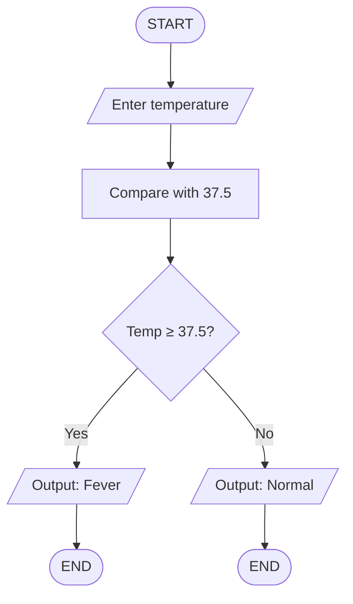

Flowcharts are graphical representations of processes, algorithms, or systems using standardized symbols.

They help visualize control flow, decision points, and execution paths in a way that bridges both technical logic and user-facing interaction.

---

## 🔹 Core Purpose

- Clarify the structure and logic of algorithms
- Aid in debugging, optimization, and documentation
- Communicate processes across technical and non-technical audiences
- Separate internal computation from external interaction

---

## 🧱 Basic Symbols

| Symbol        | Meaning                  | Shape Description | Semantic Role |
|---------------|--------------------------|-------------------|----------------|
| ⬬ `Terminal`  | Start / End              | Rounded rectangle | Entry or exit point of the flow - Good to be explicit than to be implicit |
| ⬜ `Process`   | Internal computation or transformation | Rectangle | Represents logic, operations, or function calls |
| 🔷 `Decision`  | Conditional branching    | Diamond           | Evaluates conditions to direct flow (True/False) |
| 🟦 `Input/Output` | External interaction | Parallelogram     | Represents user ↔ system data exchange |
| ➡ `Arrow`     | Flow of control          | Directed line     | Indicates execution sequence |

> [!note] 🧠 Note:
> `Process` blocks handle internal logic (e.g., calculations, function calls)
>
> `Input/Output` blocks represent conceptual interfaces—such as user input or system output—not return values or internal data flow.

---

## 🔀 Control Constructs

| Construct   | Description | Flowchart Representation |
|-------------|-------------|---------------------------|
| **Sequence** | Linear execution of steps | ⬜ → ⬜ → ⬜ |
| **Branching** | Conditional logic (if/else) | 🔷 → [Yes] / [No] paths |
| **Looping**   | Repetition based on condition | 🔷 → ⬜ → 🔷 (cycle) |

---

## 🧪 Example: Fever Check Logic

